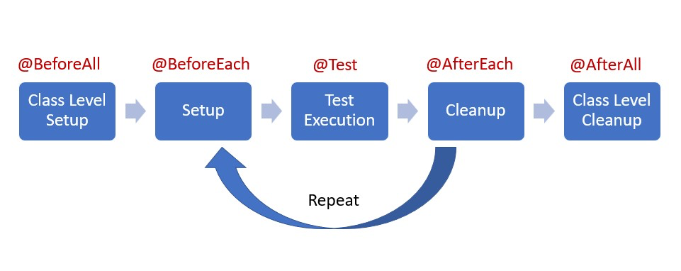

# JUnitTest

1. #### Sections to write test class logics.<br>
    a. Arrange (Given) :  Prepare and Analyze all the needed variables and objects<br>
    b. Act (When) : Actual invoke the method which we need to test<br>
    c. Assert (Then) : Validate the return value received from method under test<br>

2. #### Life cycle for test class
    

      The complete lifecycle of a test case can be seen in three phases with the help of annotations.<br>
       **Setup**: This phase puts the the test infrastructure in place. 
                    JUnit provides class level setup (@BeforeAll) and method level setup (@BeforeEach). 
                    Generally, heavy objects like databse comnections are created in class level setup while lightweight objects like test objects are reset in the method level setup.<br>
       **Test Execution** : In this phase, the test execution and assertion happen. The execution result will signify a success or failure.<br>
       **Cleanup**: This phase is used to cleanup the test infrastructure setup in the first phase. Just like setup, teardown also happen at class level (@AfterAll) and method level (@AfterEach).<br>

**Note** :<br>  
    1. By default, JUnit will create a new Test class instance for each test method. This provides a clean separation of state between tests.<br>

```diff 
 + @Disbaled("Message")  Annotation can be use to disable the test case to run but it will show in the test report.
```  

```diff
- This is a red colored line
+ This is a green colored line
@@ This is a purple colored line @@
```
